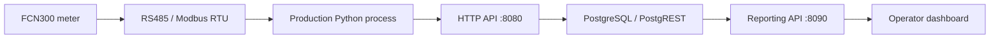

# KSC-WH FCN300 monitoring

Read-only monitoring and reporting for the workshop FCN300-3E4Y meter. The deployed production contract accepts three-phase voltage, three-phase current, and total positive active energy (`energy_kwh`).

The dashboard provides OVERVIEW, LIVE, ENERGY, COMPARE, and SYSTEM views with light/dark industrial themes, accepted V/I and kWh, server-side history aggregation, deterministic observations, coverage/gap handling, and responsive layouts. It never estimates instantaneous power from V×I and does not expose provisional P/Q/S/PF/f readings as accepted data.

Start with [HANDOFF.md](HANDOFF.md). The repository is a sanitized freeze snapshot; it contains no SSH password, database secret, private key, PGDATA, WAL, or raw transient acquisition captures.

## Repository layout

- `production/ais-energy/` — current deployed FCN300 production source.
- `dashboard/` — current deployed reporting layer and dashboard assets.
- `docs/` — architecture, operations, recovery, database, register status, and project status.
- `evidence/` — summarized validation manifests/reports; large raw captures remain excluded.
- `screenshots/dashboard/` — final visual QA captures.
- `tests/` — lightweight deterministic checks.

This monitors real industrial hardware. Modbus writes, configuration changes, broad scans, and measurement promotion require explicit approval and are out of scope for this snapshot.
